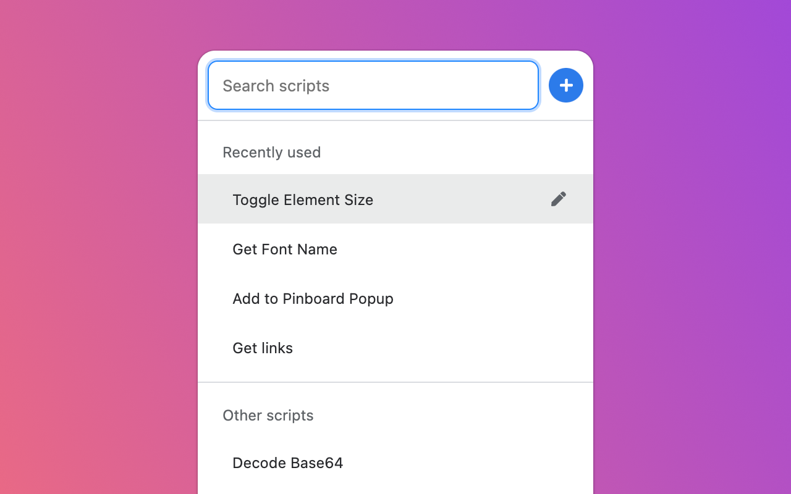

<div align="center">
  
  <br><br>

  **Chrome Extension to quickly find and run bookmarklets.**

  Available on **[Chrome Web Store](https://chrome.google.com/webstore/detail/powerlets/ofecodkcadbenmiknnidnfepbblapgkn)**

  


</div>

## Requirments

- NodeJS >=10.16
- Google Chrome or Firefox

## Setup

Install the dependencies.

```bash
$ npm i
```

After every change, run build.

```bash
$ npm run build
```

## Loading extension in web browser locally

❗️Run the build script at least once before loading extensions into the browser.

### Google Chrome

- Navigate to `chrome://extensions/`
- Toggle on "Developer mode"
- Click "Load unpacked"
- Select the `/dist` folder

### Firefox

- Navigate to `about:debugging#/runtime/this-firefox`
- Click "Load Temporary Add-on..."
- Select any file in the `/dist` folder

## Testing

Sorry, there aren't any. I wrote this in a couple of nights and during a long haul flight.

## Releasing

This is more notes for myself so I don't forget this manual process.

- Squash and merge PR branch
- Pull master locally
- Run NPM version major/minor/patch
- Update version in manifest to the same one from package.json
- Commit amend
- Push!
- Draft release with new tag
